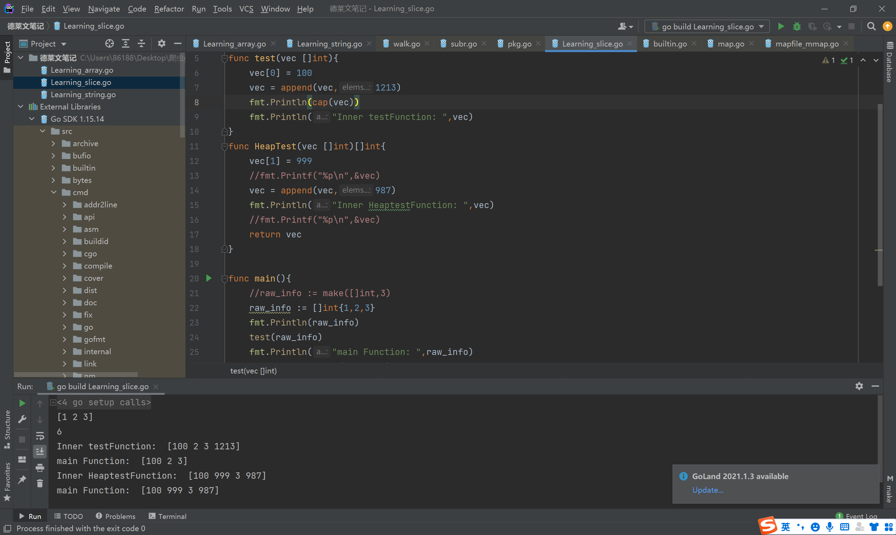

我试了试好兄弟
如果是传入切片 在函数内修改切片 但是这个切片不返回
那只能修改现有切片的值  但是改变长度是不会生效的
我估计是 如果不返回修改的切片 那就是在栈上申请的空间 然后 函数销毁这个栈就没了 申请的空间也不存在
但是如果修改slice 然后return回主函数，然后主函数有接受的话，这个slice struct副本会逃逸到栈上
这样就能实现对切片的修改 怎么改都能生效
这样会逃逸到堆上
传参都是值传递 传的是结构体
如果不返回 对这个结构体的修改 都在函数内完成 也就都在函数栈帧上
函数销毁之后就全都无了
我感觉是这样的
传进去的是结构体的副本 除了slice中的指针能指向一个地址  修改这个地址中可访问的部分 这个操作之外 其他的在main函数里都不能看到效果 因为我们改的是函数内部的那个struct结构体
在golang里面传slice本质是传了个结构体哈，也是传值，会有副本，但是slice里面的指针的值是不变的，所以对着slice结构体中的指针指向的位置进行修改是会直接生效的

