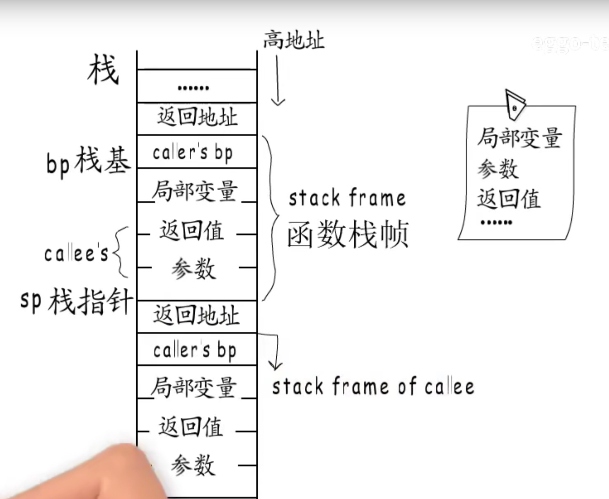
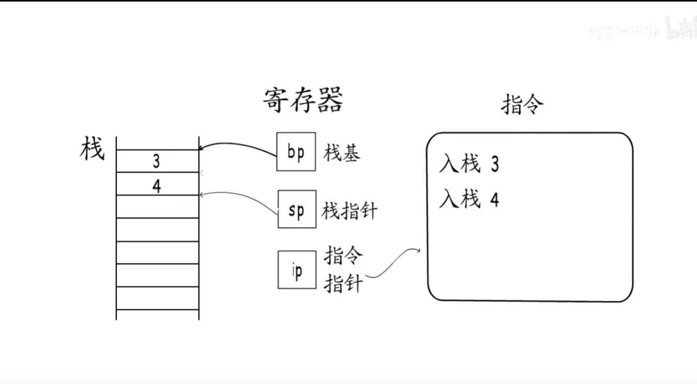
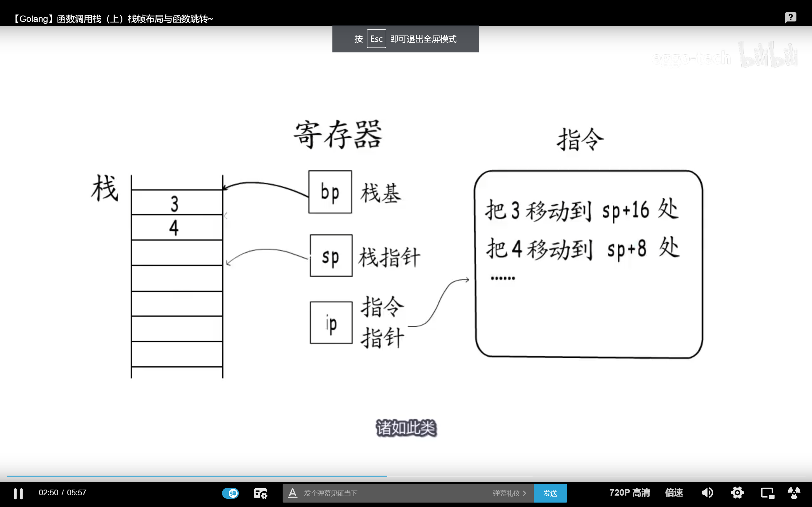
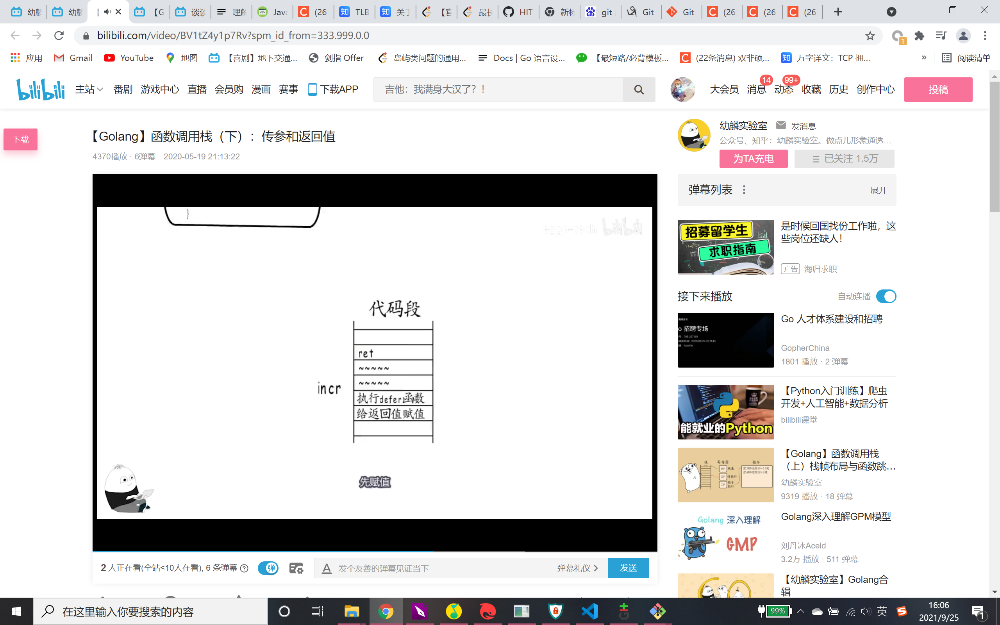

函数栈帧构成（从高地址到低地址 从栈底到栈顶）：

函数返回值
函数的参数列表（从右往左依次入栈）

func test(){

​	fmt.Println("123")

}

func main(){

​	test()

​	fmt.Println("456")

}

而call指令呢，call指令做两件事，第一件，把原函数的下一条指令的地址入栈，也就是返回地址。(在上面的代码里也就是fmt.Println("456"))这一行

第二，跳转到被调用函数的入口处执行， 下面这张图就是被调用函数的栈帧了。

bp作为栈基地址，也就是栈底

sp作为栈顶，用来入栈和弹出（一般也不用弹出，返回的时候会直接返回到bp）

ip就是当前指令的指针

但是go里面的栈帧不是逐步扩展的，而是一次性分配的，这么做是为了防止越界，调用多个函数的时候，栈帧大小以最大的为准

##### 针对有defer的情况

函数退出前，是先给返回值赋值，最后再执行注册过得defer的事务

所以 可以看到如下两个例子
